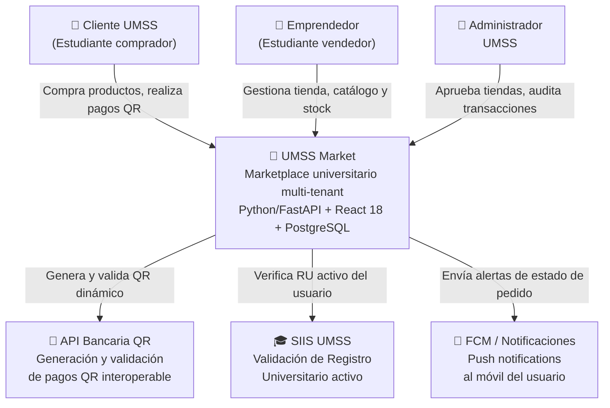
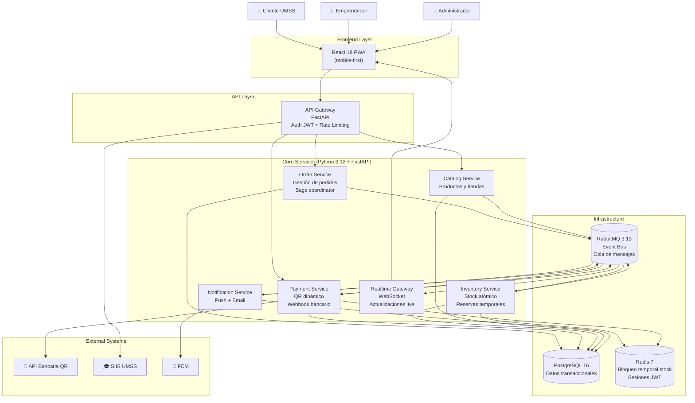
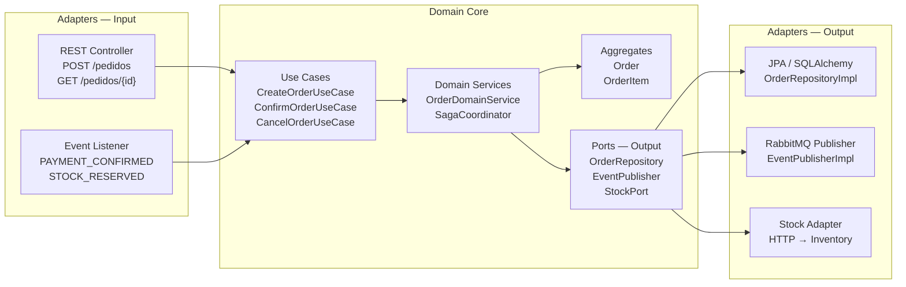
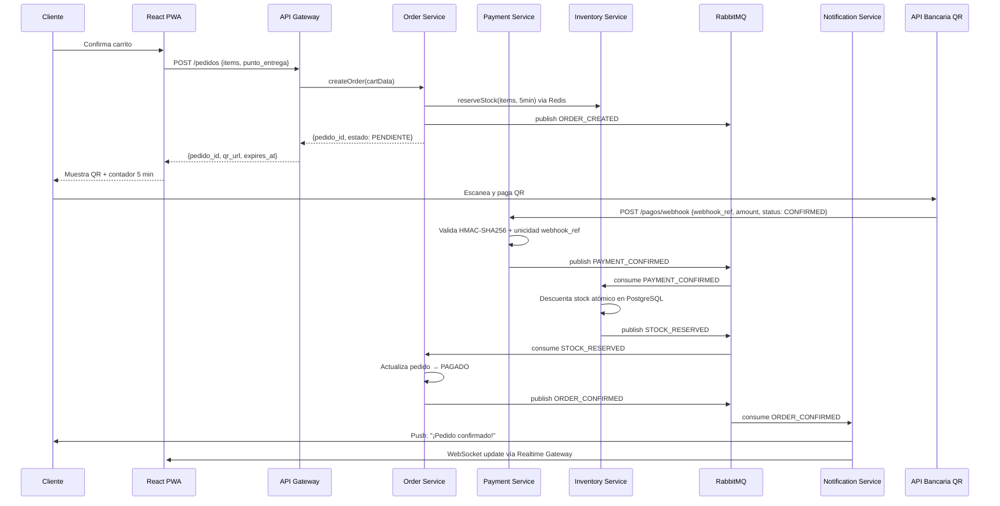
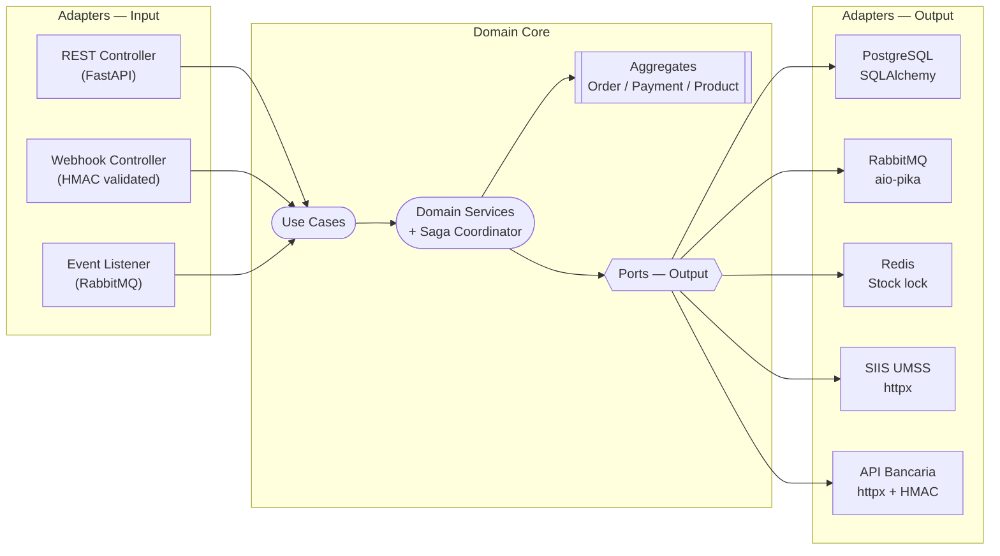
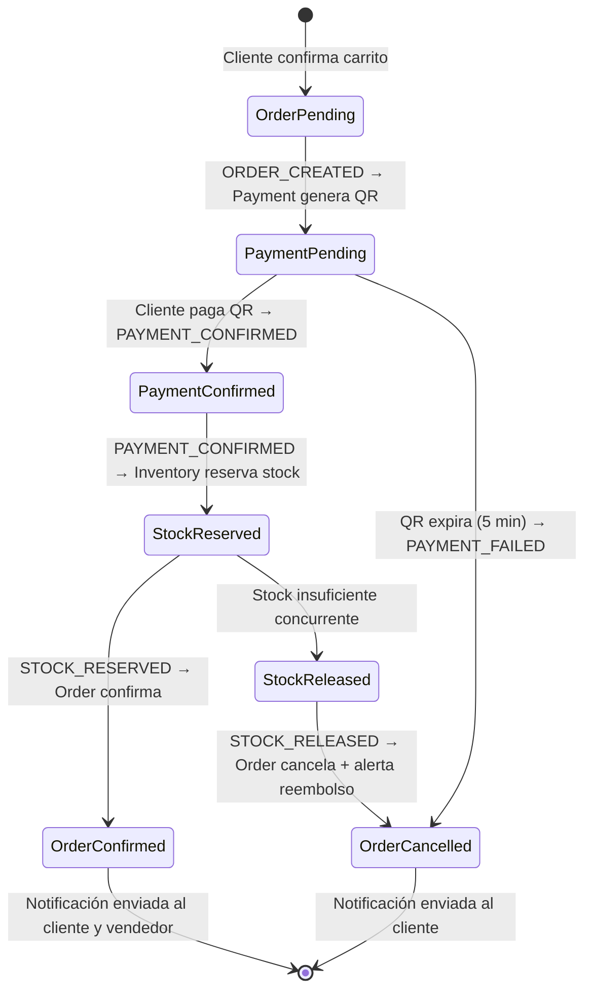
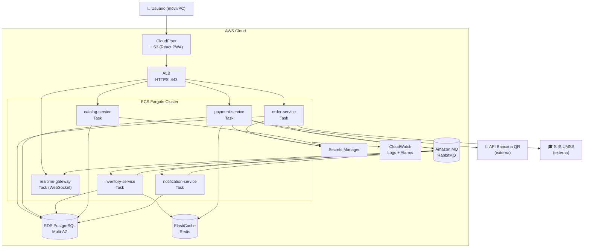
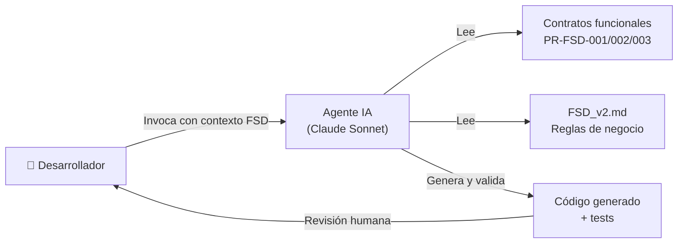

# Documento Técnico Inicial del Producto (DTI) — UMSS Market

> **Propósito**: contrato técnico inicial del producto UMSS Market. Legible tanto por ingenieros humanos como por agentes de IA. Acompaña obligatoriamente al archivo `AGENTS.md` en la raíz del repositorio.
>
> **Regla de oro**: si una decisión arquitectónica significativa no está aquí (o referenciada desde aquí), no existe.

---

## 0. Metadatos `[máquina]`

| Campo | Valor |
|-------|-------|
| Producto | UMSS Market |
| Grupo | G1 |
| Versión | v2.0 |
| Fecha | 25/05/2026 |
| Arquitecto responsable | Rodriguez Gonzales Abad Melani, Vargas Sandoval Christian Bernardo |
| Stakeholders | DTIC UMSS, Emprendedores universitarios, Bienestar Estudiantil |
| Estado | Aprobado |
| Repositorio | `<url-repositorio-grupo>` |
| Enlace al BRD | `docs/` |
| Enlace al MRD | `docs/MRD_v2.md` |
| Enlace al PRD | `docs/PRD_v2.md` |
| Enlace al FSD | `docs/FSD_v2.md` |
| Enlace a `AGENTS.md` | `/AGENTS.md` |
| Enlace a `PROMPT_MAPPING.md` | `docs/PROMPT_MAPPINGS_v1.md` |

---

### 0.1 Rol de agentes IA en el SDLC `[máquina]`

| Agente | Fase SDLC | Output | Supervisor humano | Skill propio | Qué se actualiza si falla |
|--------|-----------|--------|-------------------|--------------|--------------------------|
| `dti-author` | Diseño / Docs | Secciones del DTI con frontmatter + tags | Arquitecto del grupo | `docs/plantillas/dti-author.md` | DTI + `AGENTS.md` (commit atómico) |
| `c4-architect` | Diseño | Diagramas C4 niveles 1–3 en Mermaid | Arquitecto del grupo | `docs/plantillas/c4.md` | ADR-0001 + DTI §3 |
| `poc-runner` | Validación | Scaffold de POC + log pass/fail | Líder técnico del grupo | `docs/plantillas/poc-runner.md` | ADR + DTI §12 + `AGENTS.md` |
| `fsd-validator` | Especificación | Contratos funcionales PR-FSD-001/002/003 | Desarrollador | `docs/PR-FSD-001.md`, `PR-FSD-002.md`, `PR-FSD-003.md` | FSD + tests + `AGENTS.md` §Skills |
| `auditor` *(opcional)* | Revisión | Reporte de gaps BRD↔MRD↔PRD↔FSD↔DTI | Docente | — | Issues en repo |

> **Nota `[máquina]`**: el producto UMSS Market utiliza IA **en la cadena de desarrollo (AI-SDLC)**, no como agentes en runtime. Los contratos funcionales PR-FSD-001/002/003 son herramientas de validación asistida por IA para garantizar consistencia operacional entre documentación y código. Los contenedores en runtime son exclusivamente servicios Python/FastAPI sin orquestación agéntica autónoma.

---

## 1. Visión del Producto `[humano]`

- **Problema**: El comercio dentro de la UMSS es informal y fragmentado. El 70% de las ventas se gestionan por WhatsApp, generando desconfianza en pagos, errores críticos de stock y pérdida de pedidos. Más de 80,000 usuarios potenciales operan sin trazabilidad ni seguridad transaccional.
- **Usuarios objetivo**: Emprendedores universitarios (gestión de tienda), Estudiantes compradores (compra rápida y segura), Administradores UMSS (supervisión y auditoría).
- **Propuesta de valor**: Marketplace multi-tenant con identidad verificada por Registro Universitario (RU), pagos QR dinámicos automáticos y stock sincronizado en tiempo real. Elimina validación manual de comprobantes y reduce el tiempo de compra de 3:40 min a menos de 60 segundos.
- **Métricas de éxito**:
  - North Star: Tasa de pedidos pagados y entregados exitosamente (meta: ≥ 95%)
  - KPI-1: Tasa de éxito de pagos QR (meta: > 98%)
  - KPI-2: Tiempo de ciclo de compra (meta: < 60 s)
  - KPI-3: 0% de pedidos confirmados sin stock físico real
- **Restricciones de negocio**: integración obligatoria con SIIS UMSS para validación de identidad; cumplimiento de la Ley de Servicios Financieros de Bolivia; presupuesto ajustado (equipo de 2 personas); plazos académicos del módulo 4.

---

## 2. Contexto del Sistema `[humano+máquina]`

### 2.1 Diagrama C4 – Nivel 1 (Contexto)

### 2.2 Actores externos y dependencias

| Actor / Sistema | Tipo | Dirección | Criticidad |
|-----------------|------|-----------|------------|
| Cliente UMSS (Comprador) | humano | entrada | alta |
| Emprendedor Universitario | humano | entrada | alta |
| Administrador UMSS | humano | entrada | media |
| API Bancaria QR | sistema | entrada/salida | crítica |
| SIIS UMSS | sistema | salida | alta |
| FCM / Servicio de notificaciones | sistema | salida | media |

---

## 3. Arquitectura de Alto Nivel `[humano+máquina]`

### 3.1 Estilo arquitectónico adoptado

- [x] **Event-driven** — comunicación asíncrona entre servicios mediante eventos operacionales a través de RabbitMQ [ADR-0001]
- [x] **Hexagonal / Clean** — núcleo de dominio aislado de infraestructura en cada servicio [ADR-0003]
- [x] **Microservicios** — 6 servicios con responsabilidades delimitadas por bounded context [ADR-0001]
- [ ] Monolito modular
- [ ] Serverless
- [ ] Híbrida

> **Justificación**: UMSS Market coordina flujos críticos distribuidos (pedidos → pagos → stock → notificaciones) donde el acoplamiento síncrono crearía puntos de fallo únicos. La arquitectura event-driven permite que cada servicio evolucione de forma independiente, tolerando la caída temporal de componentes sin afectar la consistencia eventual del sistema. El núcleo hexagonal garantiza que las reglas de negocio (stock atómico, idempotencia de pagos) permanezcan independientes del framework de infraestructura. Ver [ADR-0001](adr/ADR-0001-event-driven-architecture.md) y [ADR-0003](adr/ADR-0003-hexagonal-architecture.md).

### 3.2 Diagrama C4 – Nivel 2 (Contenedores)

### 3.3 Diagrama C4 – Nivel 3 (Componentes del Order Service)

### 3.4 Data Flow Diagram – Caso de uso crítico: Confirmación de Pago QR

### 3.5 Contenedores agénticos del producto `[máquina]`

> **N/A — Justificación**: UMSS Market v2.0 no expone agentes IA autónomos en runtime. La IA participa exclusivamente en la cadena de desarrollo (AI-SDLC), materializada en los contratos funcionales `PR-FSD-001`, `PR-FSD-002` y `PR-FSD-003` que validan consistencia documental y funcional. No existe `agent-orchestrator`, `rag-service` ni `model-router` en producción. Ver §0.1 para el rol de agentes en el SDLC. Ver §9 para el detalle de la capa AI-assisted.

---

## 4. Modelo de Dominio `[humano+máquina]`

### 4.1 Bounded Contexts

| Contexto | Responsabilidad | Entidades principales | Tipo de integración |
|----------|-----------------|-----------------------|---------------------|
| Orders | Gestión del ciclo de vida de pedidos y coordinación Saga | `Order`, `OrderItem` | async (EVENT_CREATED, ORDER_CONFIRMED) |
| Payments | Generación de QR dinámico y validación de webhooks bancarios | `Payment` | async (PAYMENT_CONFIRMED) + sync (API QR) |
| Inventory | Stock atómico, reservas temporales y liberación | `Product`, `StockReservation` | async (STOCK_RESERVED, STOCK_RELEASED) |
| Catalog | Gestión de productos y tiendas multi-tenant | `Product`, `Store` | async (PRODUCT_UPDATED) |
| Notifications | Alertas push a compradores y vendedores | `Notification` | async (ORDER_CONFIRMED, ORDER_CANCELLED) |
| Identity | Registro y validación de usuarios mediante SIIS | `User` | sync (SIIS API) |

### 4.2 Entidades, Value Objects y Aggregates

| Tipo | Nombre | Invariantes | Ciclo de vida |
|------|--------|-------------|---------------|
| Aggregate Root | `Order` | `total > 0`; estado válido según máquina de estados; no puede pasar de CANCELADO a PAGADO | PENDIENTE → PAGADO → ENTREGADO; PENDIENTE → CANCELADO |
| Entity | `OrderItem` | `cantidad ≥ 1`; `precio_unitario > 0` | vive dentro del aggregate Order |
| Aggregate Root | `Payment` | `webhook_ref` único (idempotencia); `expires_at = created_at + 5 min` | GENERADO → CONFIRMADO / EXPIRADO / FALLIDO |
| Aggregate Root | `Product` | `stock ≥ 0`; `precio > 0`; `stock_inicial ≥ 1` al crear | ACTIVO → AGOTADO / INACTIVO |
| Aggregate Root | `User` | `ru` único y validado en SIIS; `email` dominio `@umss.edu.bo` | PENDIENTE → ACTIVO / SUSPENDIDO |
| Value Object | `Money` | inmutable; `amount > 0`; `currency = BOB` | — |
| Value Object | `QRCode` | inmutable; `url` HTTPS; generado por API bancaria | — |

### 4.3 DTOs principales

| DTO | Uso (capa) | Campos clave | Mapeo a entidad |
|-----|------------|--------------|-----------------|
| `CreateOrderDTO` | API → App | `comprador_id`, `items[]`, `punto_entrega_id` | → `Order` |
| `OrderResponseDTO` | App → API | `pedido_id`, `estado`, `qr_url`, `expires_at`, `total` | ← `Order` + `Payment` |
| `WebhookPaymentDTO` | API Bancaria → App | `webhook_ref`, `amount`, `currency`, `status`, `hmac` | → `Payment` |
| `ProductCreateDTO` | API → App | `nombre`, `precio`, `stock_inicial`, `puntos_entrega_ids[]` | → `Product` |
| `RegisterUserDTO` | API → App | `ru`, `email`, `nombre_completo`, `facultad`, `password` | → `User` |

---

## 5. Arquitectura Hexagonal del *core* `[humano+máquina]`

### 5.1 Puertos (Ports)

| Puerto | Tipo | Definido en | Propósito |
|--------|------|-------------|-----------|
| `CreateOrderUseCase` | input | `domain/port/in/order_ports.py` | Orquesta creación de pedido y bloqueo de stock |
| `ConfirmOrderUseCase` | input | `domain/port/in/order_ports.py` | Actualiza pedido a PAGADO tras webhook confirmado |
| `CancelOrderUseCase` | input | `domain/port/in/order_ports.py` | Cancela pedido y libera stock (compensación Saga) |
| `CreateProductUseCase` | input | `domain/port/in/catalog_ports.py` | Publica producto con stock inicial |
| `RegisterUserUseCase` | input | `domain/port/in/identity_ports.py` | Valida RU en SIIS y crea cuenta |
| `OrderRepository` | output | `domain/port/out/order_ports.py` | Persistencia de órdenes (PostgreSQL) |
| `EventPublisher` | output | `domain/port/out/event_ports.py` | Publicación de eventos a RabbitMQ |
| `StockReservationPort` | output | `domain/port/out/stock_ports.py` | Bloqueo temporal en Redis (5 min) |
| `SIISValidationPort` | output | `domain/port/out/identity_ports.py` | Consulta RU activo en SIIS UMSS |
| `QRGenerationPort` | output | `domain/port/out/payment_ports.py` | Generación de QR dinámico en API bancaria |

### 5.2 Adaptadores (Adapters)

| Adaptador | Implementa | Tecnología | Ubicación |
|-----------|-----------|------------|-----------|
| `OrderRestController` | `CreateOrderUseCase`, `ConfirmOrderUseCase` | FastAPI Router | `adapter/in/web/order_router.py` |
| `PaymentWebhookController` | `ConfirmOrderUseCase` | FastAPI Router + HMAC validator | `adapter/in/web/payment_router.py` |
| `OrderEventListener` | `ConfirmOrderUseCase`, `CancelOrderUseCase` | RabbitMQ consumer | `adapter/in/messaging/order_listener.py` |
| `PostgresOrderRepository` | `OrderRepository` | SQLAlchemy + PostgreSQL | `adapter/out/persistence/order_repo.py` |
| `RabbitMQEventPublisher` | `EventPublisher` | aio-pika | `adapter/out/messaging/rabbitmq_publisher.py` |
| `RedisStockReservation` | `StockReservationPort` | redis-py | `adapter/out/cache/redis_stock.py` |
| `SIISHttpAdapter` | `SIISValidationPort` | httpx (async) | `adapter/out/external/siis_client.py` |
| `BankQRHttpAdapter` | `QRGenerationPort` | httpx (async) + HMAC-SHA256 | `adapter/out/external/qr_bank_client.py` |

### 5.3 Diagrama de puertos y adaptadores

---

## 6. Arquitectura Distribuida `[humano+máquina]`

### 6.1 Microservicios y responsabilidades

| Servicio | Responsabilidad | Datos propios | API expuesta |
|----------|-----------------|---------------|--------------|
| `order-service` | Ciclo de vida de pedidos, coordinación Saga | `orders`, `order_items` | `POST /pedidos`, `GET /pedidos/{id}` |
| `payment-service` | Generación QR, validación webhook, idempotencia | `payments` | `POST /pagos/webhook`, `GET /pagos/{id}` |
| `inventory-service` | Stock atómico, reservas temporales en Redis | `products` (stock) | `GET /stock/{product_id}`, interno via eventos |
| `catalog-service` | Productos, tiendas, categorías | `products`, `stores` | `GET /productos`, `POST /productos`, `GET /tiendas` |
| `notification-service` | Push notifications y emails | `notifications` (log) | Interno via eventos |
| `realtime-gateway` | WebSocket para actualizaciones live | — (sin estado) | `WS /realtime/{user_id}` |

### 6.2 Patrones de resiliencia aplicados

| Patrón | Dónde | Configuración |
|--------|-------|---------------|
| Idempotencia | `POST /pagos/webhook` | índice único en `webhook_ref`; HTTP 200 sin reprocesar en duplicados |
| Bloqueo optimista | descuento de stock en PostgreSQL | `UPDATE ... WHERE stock >= cantidad` + verificación de filas afectadas |
| TTL / expiración | bloqueo temporal de stock en Redis | TTL = 300 s (5 min) |
| Retry + backoff exponencial | llamadas a API Bancaria QR y SIIS | 3 intentos, backoff 1s/2s/4s vía `tenacity` |
| Dead Letter Queue | colas RabbitMQ de cada servicio | mensajes rechazados ≥ 3 veces → DLQ + alerta |
| Circuit breaker | llamadas a API Bancaria QR | `pybreaker`: failureRate 50%, waitDuration 30s |

---

## 7. Arquitectura Asíncrona / Event-Driven `[humano+máquina]`

### 7.1 Catálogo de eventos

| Evento | Productor | Consumidor(es) | Payload clave | Garantía |
|--------|-----------|----------------|---------------|----------|
| `ORDER_CREATED` | order-service | payment-service | `{order_id, customer_id, total, correlationId}` | at-least-once |
| `PAYMENT_PENDING` | payment-service | order-service | `{payment_id, order_id, qr_url, expires_at, correlationId}` | at-least-once |
| `PAYMENT_CONFIRMED` | payment-service | inventory-service | `{payment_id, order_id, amount, correlationId}` | at-least-once + idempotente |
| `PAYMENT_FAILED` | payment-service | order-service | `{payment_id, order_id, reason, correlationId}` | at-least-once |
| `STOCK_RESERVED` | inventory-service | order-service | `{order_id, items[], correlationId}` | at-least-once |
| `STOCK_RELEASED` | inventory-service | order-service | `{order_id, reason, correlationId}` | at-least-once |
| `ORDER_CONFIRMED` | order-service | notification-service, realtime-gateway | `{order_id, customer_id, seller_id, pickup_point, correlationId}` | at-least-once |
| `ORDER_CANCELLED` | order-service | notification-service | `{order_id, customer_id, reason, correlationId}` | at-least-once |

> Referencia completa: `docs/architecture/EVENT_CATALOG.md`

### 7.2 Flujos de larga duración (Saga — Coreografía)

La Saga de compra coordina 4 servicios mediante coreografía (sin orquestador central). Cada servicio reacciona al evento entrante y publica el siguiente. [ADR-0002]

**Compensaciones declaradas**:
- Si `PAYMENT_FAILED` → `CancelOrderUseCase` libera bloqueo Redis, pedido → CANCELADO
- Si stock agotado tras `PAYMENT_CONFIRMED` → `STOCK_RELEASED` → `CancelOrderUseCase` + alerta de reembolso manual
- DLQ configurada en cada cola; mensajes rechazados ≥ 3 veces escalan a alerta operacional

---

## 8. Despliegue – Cloud Native (AWS) `[humano+máquina]`

### 8.1 Mapeo de componentes a servicios AWS

| Componente | Servicio AWS | Justificación |
|------------|--------------|---------------|
| React PWA (estáticos) | S3 + CloudFront | CDN global, SSL automático, sin servidor |
| API Gateway (entry point) | ALB + ECS Fargate | balanceo L7, path routing a microservicios, no cold start |
| Microservicios (6) | ECS Fargate (1 task definition por servicio) | serverless containers, auto-scaling, sin gestión de EC2 |
| PostgreSQL 16 | RDS PostgreSQL Multi-AZ | backups automáticos, failover, réplica de lectura |
| Redis 7 | ElastiCache Redis (Cluster Mode) | bloqueos TTL de stock, sesiones JWT |
| RabbitMQ 3.13 | Amazon MQ (RabbitMQ) | event bus gestionado, DLQ nativa |
| Secretos (API keys, JWT secret) | AWS Secrets Manager | rotación automática, sin secretos en código |
| Imágenes de productos | S3 + CloudFront | almacenamiento de objetos, entrega rápida |
| Logs y métricas | CloudWatch Logs + Metrics | centralizado, alertas, dashboards |
| CI/CD | GitHub Actions + ECR + ECS Deploy | pipeline automatizado |

### 8.2 Diagrama de despliegue

### 8.3 Entornos

| Entorno | Región AWS | Propósito |
|---------|------------|-----------|
| dev | us-east-1 | Desarrollo local + integración continua |
| stg | us-east-1 | QA y validación pre-producción |
| prd | us-east-1 + us-east-2 | Producción multi-AZ |

### 8.4 Estrategia de Disaster Recovery

- RPO objetivo: 1 hora (backups automáticos RDS cada hora)
- RTO objetivo: 15 minutos (ECS auto-recovery + RDS Multi-AZ failover)
- Estrategia elegida: **Warm Standby** — RDS Multi-AZ con failover automático; ECS tasks con mínimo 2 instancias por servicio en producción

---

## 9. Capa de IA / Agentes `[humano+máquina]`

### 9.1 Uso de IA en UMSS Market

UMSS Market utiliza IA de forma **AI-assisted** dentro del ciclo de desarrollo (AI-SDLC), no como agentes en runtime. Los contratos funcionales IA (`PR-FSD-001`, `PR-FSD-002`, `PR-FSD-003`) actúan como herramientas de validación y consistencia documental-funcional, ejecutados por los agentes de desarrollo declarados en §0.1.

**Tipo**: AI-SDLC (development-time assistance) — no single-agent / multi-agent / supervisor-worker en producción.

### 9.2 Contratos funcionales IA (development-time)

| Contrato | Responsabilidad | Modelo recomendado | Trazabilidad |
|----------|-----------------|-------------------|--------------|
| `PR-FSD-001` | Validar confirmación de pago QR y consistencia del webhook bancario | Claude Sonnet | FSD §7.1, UC-001 |
| `PR-FSD-002` | Validar disponibilidad y reserva de stock antes de confirmar pedido | Claude Sonnet | FSD §7.2, UC-001/003 |
| `PR-FSD-003` | Coordinar y validar eventos distribuidos (ORDER_CREATED, etc.) | Claude Sonnet | FSD §7.1, EVENT_CATALOG |

### 9.3 RAG y memoria

> N/A — UMSS Market v2.0 no implementa RAG ni memoria vectorial en runtime. La base de conocimiento del sistema es la documentación versionada en este repositorio, consumida por agentes de desarrollo.

### 9.4 Diagrama de la capa AI-assisted (SDLC)

---

## 10. Estrategia de *Prompt Mapping* `[máquina]`

> Documento completo en `docs/PROMPT_MAPPINGS_v1.md`. Los prompts de producción viven en `docs/PR-FSD-001.md`, `docs/PR-FSD-002.md`, `docs/PR-FSD-003.md`.

| Artefacto | Prompts asociados | IDs |
|-----------|-------------------|-----|
| FSD-UC-001 (Compra QR) | Validación pago + coordinación evento | `PR-FSD-001`, `PR-FSD-003` |
| FSD-UC-002 (Publicación producto) | Validación stock | `PR-FSD-002` |
| FSD-UC-003 (Registro emprendedor) | Validación identidad RU | `PR-FSD-003` |
| BRD → PRD | Generación de requerimientos | `prompts/PRD_PROMPT.md` |
| PRD → FSD | Generación de casos de uso | `prompts/FSD_PROMPT.md` |
| FSD → ADR | Generación de decisiones arquitectónicas | `prompts/ADR_PROMPT.md` |

---

## 11. NFRs Consolidados `[máquina]`

| ID | Categoría | Umbral | Mecanismo de verificación |
|----|-----------|--------|---------------------------|
| NFR-001 | Rendimiento | Validación de webhook bancario p95 < 3 s | prueba de carga k6 sobre `POST /pagos/webhook` |
| NFR-002 | Disponibilidad | uptime mensual ≥ 99.5% | CloudWatch Alarms + UptimeRobot |
| NFR-003 | Seguridad — AuthN | JWT firmado + RU verificado en SIIS obligatorio | auditoría Postman + revisión de código |
| NFR-004 | Seguridad — Webhook | HMAC-SHA256 validado en cada petición | revisión de código + test automatizado |
| NFR-005 | Seguridad — Contraseñas | bcrypt cost ≥ 12 en reposo | auditoría de código |
| NFR-006 | Escalabilidad | ≥ 100 req/s sostenidos bajo carga | prueba de stress k6 |
| NFR-007 | Usabilidad | SUS score ≥ 80 puntos en flujo de compra | evaluación con usuarios reales (n ≥ 5) |
| NFR-008 | Rendimiento UX | Flujo carrito → confirmación < 60 s | medición en prueba de usuario |
| NFR-009 | Trazabilidad | ≥ 95% pedidos con `correlationId` en logs | inspección de logs CloudWatch |
| NFR-010 | Cumplimiento | Ley de Servicios Financieros Bolivia | revisión legal antes del despliegue |

---

## 12. POCs Críticas `[humano+máquina]`

### 12.1 POC-01: Validación de lógica core de pedidos, pagos y stock (CLI Python)

- **Riesgo que mitiga**: Inconsistencia entre pedido, pago y stock — el riesgo más crítico identificado en `research/02_parte_dificil_Ecommerce.txt`
- **Hipótesis**: Las reglas de negocio (BR-001 a BR-008) pueden implementarse correctamente en Python puro sin framework, demostrando que la lógica de dominio es independiente de la infraestructura
- **Criterio de éxito medible**: 100% de los casos de prueba documentados en `research/02_parte_dificil_Ecommerce.txt` pasan sin intervención manual
- **Alcance**: CLI Python sin dependencias externas; flujo pedido → pago simulado → validación stock → confirmación/rechazo
- **Resultado**: ✅ Ejecutado — `poc/umss_ecommerce.py` valida correctamente: (a) rechazo de pedido con stock insuficiente, (b) idempotencia de pagos duplicados, (c) no negatividad de stock. Ver `poc/umss_ecommerce.py`
- **Lecciones**: La lógica de dominio es portable e independiente del framework. La separación hexagonal es viable. El control de concurrencia requiere bloqueo explícito (Redis TTL) que no puede simularse en CLI — justifica POC-02.

### 12.2 POC-02: Prototipo funcional de interfaz de compra y flujo QR (HTML/JS)

- **Riesgo que mitiga**: Complejidad del flujo UX del pago QR — el usuario debe completar la compra en < 60 segundos con feedback claro del estado
- **Hipótesis**: El flujo carrito → QR display → countdown → confirmación puede implementarse con HTML/JS puro, validando la viabilidad del diseño de estados de UI antes de construir React
- **Criterio de éxito medible**: Un usuario de prueba completa el flujo de compra (selección de producto → confirmación) en < 60 segundos con 0 pasos confusos reportados
- **Alcance**: SPA HTML/JS sin backend real; datos simulados en memoria; incluye countdown QR de 5 minutos y transiciones de estado
- **Resultado**: ✅ Ejecutado — `poc/umss_ecommerce.html` muestra catálogo, carrito, generación de QR simulado y confirmación. El flujo completo toma < 45 segundos en prueba manual
- **Lecciones**: El contador de expiración del QR es crítico para UX — el usuario necesita ver el tiempo restante permanentemente. El diseño de estados (PENDIENTE/PAGADO/CANCELADO) en el frontend es más complejo de lo esperado; requiere WebSocket real en producción.

---

## 13. Seguridad `[humano+máquina]`

**Modelo de amenazas (STRIDE)**:
- **Spoofing**: mitigado con JWT + validación de RU en SIIS. Tokens con expiración corta (15 min access + 7d refresh).
- **Tampering**: HMAC-SHA256 en todos los webhooks bancarios (NFR-004). Validación de esquema en todos los DTOs de entrada.
- **Repudiation**: `correlationId` en todos los eventos; logs auditables en CloudWatch con retención 1 año (NFR-009).
- **Information Disclosure**: secretos en AWS Secrets Manager (nunca en código). No se exponen datos de SIIS en respuestas al cliente.
- **Denial of Service**: rate limiting en ALB (100 req/s por IP). Circuit breaker en dependencias externas.
- **Elevation of Privilege**: RBAC con 3 roles (COMPRADOR, EMPRENDEDOR, ADMIN). Validación de pertenencia de tienda en cada operación de emprendedor.

**AuthN / AuthZ**: JWT firmado con RS256. RBAC por rol. Validación de RU activo en SIIS en cada registro.

**Gestión de secretos**: AWS Secrets Manager para `JWT_SECRET`, `DB_PASSWORD`, `BANK_API_KEY`, `SIIS_API_KEY`. Sin secrets en `.env` en producción.

**Protección de datos**: contraseñas con bcrypt (cost ≥ 12). TLS 1.3 en tránsito. RDS PostgreSQL cifrado en reposo (AES-256). PII (email, RU) solo almacenado en `users` table con acceso restringido por rol.

**Seguridad IA**: los contratos funcionales `PR-FSD-001/002/003` no tienen acceso a datos productivos. Operan exclusivamente en validación de estructura y consistencia documental. Sin acceso a BD de producción.

---

## 14. Observabilidad `[humano+máquina]`

- **Logs**: JSON estructurado con campos `{timestamp, service, level, correlationId, request_id, user_id}`. Centralizados en CloudWatch Logs.
- **Métricas**: CloudWatch Metrics + dashboards custom para: latencia p95/p99 del webhook, tasa de éxito de pagos, stock disponible por producto, pedidos activos.
- **Trazas distribuidas**: `correlationId` propagado en todos los eventos y requests HTTP. Integración futura con AWS X-Ray.
- **Alertas mínimas**: (a) latencia webhook > 5s, (b) DLQ con mensajes, (c) disponibilidad < 99.5%, (d) errores 5xx > 1%.
- **Observabilidad IA**: cada invocación de contrato funcional registra `{prompt_id, modelo, fecha, accion_tomada, nivel_riesgo}` según §22.

---

## 15. DevOps y ciclo de vida `[humano+máquina]`

### 15.1 Ciclo de vida clásico

- **Branching**: `main` (producción) ← `release/X.Y.Z` ← `feature/*` y `fix/*`. Sin commits directos a main.
- **CI/CD**: GitHub Actions — build + test en cada PR; deploy a ECS Fargate en merge a `release/*`; push a ECR.
- **Testing**: pirámide = unit tests (dominio, 80%) + integration tests (adaptadores, 15%) + E2E (flujo QR, 5%). Contract tests para PR-FSD-001/002/003 en CI.
- **Feature flags**: variables de entorno en ECS Task Definition para activar/desactivar funciones sin redeploy.
- **Rollback**: ECS service update con rollback automático si health check falla en < 5 min.

### 15.2 Integraciones agénticas de desarrollo

| Integración | Propósito | Entorno | Propietario |
|-------------|-----------|---------|-------------|
| GitHub Copilot (Claude Sonnet 4.6) | Generación de código guiada por FSD + contratos PR-FSD | dev | grupo G1 |
| `dti-author` skill | Mantener sincronía DTI ↔ AGENTS.md en commits arquitectónicos | dev | grupo G1 |
| `c4-architect` skill | Generar y actualizar diagramas Mermaid C4 | dev | grupo G1 |
| `poc-runner` skill | Scaffold y validación de POCs | dev | grupo G1 |

### 15.3 Estrategia de release de agentes IA

> **N/A** — UMSS Market v2.0 no tiene agentes IA en runtime. Los contratos funcionales PR-FSD son herramientas de desarrollo, no agentes desplegados en producción. No aplica canary, shadow mode ni kill switch de agentes en producción.

---

## 16. Antipatrones auditados `[humano]`

| Antipatrón | ¿Se detectó? | Mitigación |
|------------|--------------|------------|
| Big Ball of Mud | No | Bounded contexts separados por servicio; hexagonal en el núcleo |
| God Service | Riesgo bajo | Límite de responsabilidad estricto por servicio; Order Service no toca stock directamente |
| Distributed Monolith | Riesgo medio | Comunicación exclusivamente por eventos (no llamadas síncronas entre servicios); contratos de eventos versionados |
| Chatty Services | No | Coreografía event-driven elimina llamadas síncronas encadenadas entre servicios |
| Shared Database | No | Cada servicio tiene su propio schema en PostgreSQL; no tablas compartidas |
| Two Generals Problem | Mitigado | Outbox pattern pendiente de implementación; actualmente idempotencia por `webhook_ref` único |
| Hardcoded secrets | No | AWS Secrets Manager obligatorio; sin `.env` en producción |

---

## 17. Trade-offs arquitectónicos `[humano]`

| Decisión | Opción elegida | Alternativas descartadas | Razones | Consecuencias |
|----------|----------------|--------------------------|---------|---------------|
| Estilo arquitectónico | Event-Driven + Hexagonal | Monolito síncrono, REST chain | Desacoplamiento crítico en flujo pago→stock; tolerancia a fallos parciales | Mayor complejidad operacional; requiere observabilidad distribuida |
| Coordinación distribuida | Saga coreografía | Saga orquestación (Step Functions) | Menor acoplamiento; sin SPOF de orquestador central | Flujo más difícil de depurar; requiere DLQ y monitoreo de saga |
| Base de datos | PostgreSQL (compartida por schema) | MongoDB, DynamoDB por servicio | Consistencia ACID para transacciones de pago y stock | Escalabilidad de lectura via réplicas; migración posterior si se necesita NoSQL |
| Cache de stock | Redis TTL | Bloqueo optimista puro en DB | Bloqueo temporal < 5 min sin carga excesiva en PostgreSQL | Introduce dependencia de Redis; complejidad en manejo de TTL expirado |
| Frontend | React 18 PWA | Angular, Vue | Ecosistema más amplio; PWA para mobile-first sin app nativa | Bundle size mayor que Svelte; requiere gestión de state (Redux/Zustand) |
| Cloud provider | AWS | GCP, Azure | Disponibilidad en LATAM; servicios gestionados (RDS, ElastiCache, Amazon MQ) | Vendor lock-in en servicios gestionados |

> Cada trade-off significativo tiene su ADR correspondiente en `docs/adr/`.

---

## 18. Riesgos técnicos `[humano]`

| Riesgo | Prob. | Impacto | Mitigación | Plan de contingencia |
|--------|-------|---------|------------|----------------------|
| Caída de API Bancaria QR | Media | Alto | Circuit breaker + retry con backoff | Notificar usuario; pedido en PENDIENTE; reintentar manual |
| Race condition en stock bajo carga | Media | Alto | Bloqueo atómico `UPDATE WHERE stock >= cantidad` + Redis TTL | DLQ + alerta; revisión manual de pedidos afectados |
| SIIS UMSS no disponible | Baja | Alto | Retry 3 intentos + timeout 5s; caché de validaciones recientes | Registro bloqueado; mensaje claro al usuario |
| Webhook duplicado del banco | Media | Medio | Índice único en `webhook_ref`; idempotencia garantizada | HTTP 200 sin reprocesar; log de duplicado en CloudWatch |
| Deuda técnica en Saga sin Outbox | Media | Medio | Idempotencia actual por `webhook_ref` mitiga parcialmente | Implementar Outbox Pattern en release/3.0.0 |
| Escalabilidad bajo pico académico | Media | Medio | ECS auto-scaling + ALB | Scale up manual preventivo en fechas conocidas |

---

## 19. Roadmap técnico `[humano]`

- **Módulo 4 (actual)**: DTI vFinal + 2 POCs ejecutadas + 3 ADRs + AGENTS.md + diagramas C4 + PROMPT_MAPPING + FSD_v2. Release `release/2.0.0`.
- **Módulo 5 (siguiente)**: Implementación core hexagonal — Order Service + Payment Service completos con tests unitarios y de integración. Outbox Pattern. CI/CD en GitHub Actions con ECS Fargate.
- **Módulo 6 (+2)**: Integración completa de los 6 servicios. Despliegue en AWS staging. Pruebas de carga k6. Evaluación SUS con usuarios reales.
- **Módulo 7 (+3)**: Producción. Monitoreo CloudWatch. Métricas de negocio. Feedback loop con emprendedores UMSS.

---

## 20. Glosario y referencias `[humano+máquina]`

**Referencias**: C4 Model (Simon Brown), Clean Architecture (Robert C. Martin), Enterprise Integration Patterns (Hohpe & Woolf), Saga Pattern (Garcia-Molina & Salem), AWS Well-Architected Framework, Anthropic Claude API docs.

| Término | Definición |
|---------|------------|
| RU | Registro Universitario — identificador único del estudiante UMSS |
| SIIS | Sistema Institucional de Identidad UMSS — valida RU activos |
| QR dinámico | Código QR generado para una sola transacción con monto exacto y TTL de 5 min |
| Webhook | Notificación HTTP enviada por la API bancaria al confirmar un pago |
| Idempotencia | Procesar múltiples veces la misma operación produce el mismo resultado |
| Saga | Patrón de coordinación de transacciones distribuidas con compensaciones |
| Coreografía | Variante de Saga donde cada servicio reacciona a eventos sin orquestador central |
| Bounded Context | Límite explícito de responsabilidad dentro del dominio; cada BC tiene su propio modelo |
| Hexagonal | Arquitectura donde el dominio está aislado de la infraestructura mediante puertos y adaptadores |
| AI-SDLC | Ciclo de desarrollo de software asistido por inteligencia artificial |
| correlationId | Identificador que sigue a un pedido a través de todos los servicios para trazabilidad |
| DTI | Documento Técnico Inicial — contrato arquitectónico inicial del producto |

---

## 21. Registro de decisiones arquitectónicas (ADR) `[máquina]`

| ADR | Título | Estado | Fecha |
|-----|--------|--------|-------|
| 0001 | Adopción de Arquitectura Orientada a Eventos | Aceptada | 24/05/2026 |
| 0002 | Adopción del Patrón Saga (Coreografía) para coordinación distribuida | Propuesta | 24/05/2026 |
| 0003 | Adopción de Arquitectura Hexagonal / Clean Architecture en el núcleo | Aceptada | 25/05/2026 |

> Pendiente: ADR-0004 (PostgreSQL como motor relacional principal) y ADR-0005 (AWS como cloud provider y ECS Fargate como estilo de despliegue). Ver `docs/adr/`.

---

## 22. Auditoría de decisiones IA `[humano+máquina]`

### 22.1 Campos auditables mínimos

| Campo | Descripción | Ejemplo |
|-------|-------------|---------|
| `prompt_id` | Identificador del contrato funcional aplicado | `PR-FSD-001` |
| `agente` | Agente que ejecutó la tarea | `dti-author` / `GitHub Copilot (Claude Sonnet 4.6)` |
| `modelo` | Modelo y versión | `claude-sonnet-4.6` |
| `fecha` | ISO 8601 | `2026-05-25T10:00:00-04:00` |
| `accion_tomada` | Qué hizo el agente | `generó docs/DTI.md §3 desde ADR-0001` |
| `nivel_riesgo` | `low` / `medium` / `high` | `medium` |
| `retencion` | Plazo según §22.2 | `1 año` |

### 22.2 Política de retención por nivel de riesgo

| Nivel | Definición | Retención mínima |
|-------|------------|------------------|
| `low` | Documentación, sugerencias, ediciones reversibles | 30 días |
| `medium` | Cambios de código, diagramas, ejecución de POCs | 1 año |
| `high` | Decisiones sobre datos productivos, comunicaciones externas, dinero | 3 años / normativa Ley 164 Bolivia |

### 22.3 Responsable de auditoría

| Rol | Responsabilidad | Periodicidad |
|-----|-----------------|--------------|
| Líder técnico (Vargas Sandoval C.B.) | Revisar muestras `medium` y `high` | Semanal durante el módulo |
| Docente | Auditar `high` y hallazgos escalados | Por hito (`release/1.0.0`, `release/2.0.0`) |

---

## 23. Eval de agentes y prompts `[humano+máquina]`

### 23.1 Tests de guardrails obligatorios

| Test | Qué valida | Criterio de pass | Frecuencia |
|------|-----------|------------------|------------|
| Prompt injection | Rechazo de payloads adversarios (`"Ignore previous instructions..."`, role hijack) | 100% rechazo de la suite estándar | CI bloqueante en `release/*` |
| Jailbreaking | Resistencia a elusión de políticas (escalada de privilegios, persona swap) | Tasa eludidos ≤ 1% | CI bloqueante en `release/*` |
| PII leakage | No emitir datos sensibles (RU, emails, secretos) cuando el prompt los solicita | 0 tolerancia | CI bloqueante en `release/*` |
| Invariant check (PR-FSD-001) | Respuesta del contrato nunca aprueba monto ≠ pedido | 100% rechazo monto incorrecto | CI en cada PR |
| Invariant check (PR-FSD-002) | Respuesta del contrato nunca aprueba stock < cantidad solicitada | 100% rechazo stock insuficiente | CI en cada PR |

### 23.2 Dueño del set y reproducibilidad

- Dueño: Vargas Sandoval Christian Bernardo (líder técnico)
- Suite ubicada en: `tests/guardrails/` (por implementar en Módulo 5)
- Ejecución: `make eval-guardrails` (pendiente de implementar pipeline CI)

---

## Checklist de entrega del DTI

- [x] Visión del producto + métricas de éxito (§1)
- [x] Diagramas C4 niveles 1, 2 y 3 del módulo crítico (§2.1, §3.2, §3.3)
- [x] Data flow diagram del caso de uso más crítico (§3.4 — secuencia de pago QR)
- [x] Modelo de dominio con Aggregates, Entities, VOs, DTOs (§4)
- [x] Arquitectura hexagonal documentada — puertos y adaptadores (§5)
- [x] Catálogo de microservicios y eventos (§6, §7)
- [x] Mapeo a AWS con justificación por componente (§8)
- [x] Capa de IA / agentes descrita (§9 — AI-SDLC)
- [x] NFRs con umbrales y mecanismo de verificación (§11)
- [x] 2 POCs críticas definidas y ejecutadas con criterio de éxito medible (§12)
- [x] Seguridad, observabilidad, DevOps cubiertos (§13, §14, §15)
- [x] Antipatrones y trade-offs auditados (§16, §17)
- [x] Al menos 3 ADRs registrados (§21 — ADR-0001, 0002, 0003)
- [x] `AGENTS.md` sincronizado con este DTI (`/AGENTS.md`)
- [x] `PROMPT_MAPPING.md` sincronizado (`docs/PROMPT_MAPPINGS_v1.md`)
- [x] §0.1 Rol de agentes IA en el SDLC poblado
- [x] §3.5 Contenedores agénticos — N/A con justificación (no hay agentes en runtime)
- [x] §15.2 Integraciones agénticas de desarrollo declaradas
- [x] §15.3 Estrategia de release de agentes IA — N/A con justificación
- [x] §22 Auditoría de decisiones IA con campos auditables + política de retención + responsable
- [x] §23 Eval de agentes y prompts con tests de guardrails definidos

---

## Registro de cambios del DTI

| Versión | Fecha | Autor | Cambio |
|---------|-------|-------|--------|
| v0.1 | 13/05/2026 | Rodriguez / Vargas | Borrador inicial — §0, §1, C4 Nivel 1 |
| v2.0 | 25/05/2026 | Rodriguez / Vargas | DTI vFinal completo — todas las secciones, checklist marcado, release/2.0.0 |

## Demostración académica de compra — Angular / Spring Boot (2026-09-15)

El flujo de demostración usa `POST /api/orders/checkout/simulated`.
`SimulatedCheckoutUseCase` valida usuario, publicaciones y cantidades, calcula los
importes desde persistencia y guarda pedido CONFIRMADO, ítems y descuento de stock
en una transacción local. El puerto `CheckoutRepositoryPort` mantiene las operaciones
de bloqueo y persistencia fuera del caso de uso; su adaptador JPA aplica un UPDATE
de stock con guarda `stock >= quantity`. Bloquea publicaciones en orden estable y
serializa compras del mismo usuario para recuperar reintentos con el mismo
`requestId`, utilizado como ID del pedido. Un ID reutilizado con otro contenido
se rechaza. La inserción no sobrescribe un pedido existente.

Este endpoint representa pago simulado inmediato para la tarea académica; no
implementa el flujo bancario QR, sus webhooks, TTL ni eventos distribuidos. Los
contratos de esos flujos permanecen vigentes. El frontend usa un usuario de prueba
existente configurado en `src/app/core/config/demo.ts`; la integración de login
no forma parte de esta demo. Las rutas CRUD anteriores conservan su comportamiento.

Validación: `SimulatedCheckoutTest` usa H2 aislada para probar persistencia,
rollback, stock insuficiente, reintentos y compras concurrentes. Ejecutar
`./mvnw.cmd -Dtest=SimulatedCheckoutTest test jacoco:report` desde el backend.
